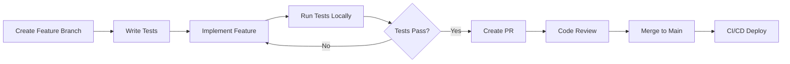

# 🚀 PROJECT ENHANCEMENT PLAN - GST Billing System
## Strategic Analysis & Roadmap

---

## 📊 EXECUTIVE SUMMARY

### Current State Analysis
**Project Name:** AG-PROJ02 - "Simplest GST Billing app"  
**Tech Stack:** Django 6.0, SQLite, jQuery, Bootstrap 4.4.1  
**Maturity Level:** Production-ready with comprehensive features  
**Architecture:** MVT (Model-View-Template) monolithic application  

**Key Strengths:**
- ✅ Complete GST compliance (GSTR-1, GSTR-3B, GSTR-9)
- ✅ Full invoice lifecycle (creation, returns, payments, discounts)
- ✅ Inventory management with tracking
- ✅ Customer and vendor management
- ✅ Purchase invoice tracking with ITC ledger
- ✅ Reconciliation and audit logs
- ✅ Clean separation of concerns (13 view modules)
- ✅ Recent enhancements (return invoices, customer transactions)

**Critical Gaps:**
- ❌ No automated testing (0% coverage)
- ❌ Security vulnerabilities (DEBUG=True, SECRET_KEY exposed, no HTTPS)
- ❌ No authentication for sensitive operations
- ❌ Limited scalability (SQLite, synchronous processing)
- ❌ No API for third-party integration
- ❌ Outdated frontend (jQuery over React/Vue)
- ❌ No mobile-responsive design
- ❌ Missing business intelligence/reporting
- ❌ No backup/disaster recovery system
- ❌ Minimal documentation for deployment

---

## 🔍 DETAILED ANALYSIS

### 1. ARCHITECTURE REVIEW

#### **Current Architecture:**
```
┌─────────────────────────────────────────┐
│          Django Application             │
│  ┌────────────────────────────────────┐ │
│  │  Views (94 functions)              │ │
│  │  - auth, invoices, products        │ │
│  │  - customers, books, inventory     │ │
│  │  - purchases, returns, GST reports │ │
│  └────────────────────────────────────┘ │
│  ┌────────────────────────────────────┐ │
│  │  Models (21 entities)              │ │
│  │  - User management (3)             │ │
│  │  - Core business (8)               │ │
│  │  - Accounting (3)                  │ │
│  │  - GST compliance (4)              │ │
│  │  - Customer transactions (3)       │ │
│  └────────────────────────────────────┘ │
│  ┌────────────────────────────────────┐ │
│  │  SQLite Database                   │ │
│  └────────────────────────────────────┘ │
└─────────────────────────────────────────┘
```

#### **Identified Issues:**
- **No API Layer:** Tightly coupled frontend-backend
- **No Caching:** Every request hits database
- **No Background Jobs:** Long-running tasks block requests
- **Monolithic:** Difficult to scale individual components
- **No Service Layer:** Business logic scattered in views

---

### 2. DATA MODEL ANALYSIS

#### **21 Models Breakdown:**

**SAAS Models (3):**
- ✅ `UserProfile` - Business details, GST info
- ⚠️ `Plan` - Defined but underutilized
- ⚠️ `BillingProfile` - Not integrated into workflow

**Core Business Models (8):**
- ✅ `Customer` - Complete with geolocation
- ✅ `Invoice` - Comprehensive GST-compliant invoicing
- ✅ `Product` - Basic product management
- ✅ `Inventory` - Stock tracking
- ✅ `InventoryLog` - Transaction history
- ✅ `Book` - Customer ledger
- ✅ `BookLog` - Transaction records
- ✅ `PurchaseLog` - Purchase tracking

**Vendor Models (2):**
- ✅ `VendorPurchase` - Vendor management
- ✅ `ExpenseTracker` - Expense recording

**GST Compliance Models (4):**
- ✅ `PurchaseInvoice` - Input tax credit tracking
- ✅ `GSTReturn` - Return filing records
- ✅ `GSTRReconciliation` - GSTR-2A reconciliation
- ✅ `AuditLog` - Compliance audit trail

**Customer Transaction Models (3):**
- ✅ `ReturnInvoice` - Return/credit notes (Recently added)
- ✅ `CustomerPayment` - Payment tracking (Recently added)
- ✅ `CustomerDiscount` - Discount management (Recently added)

**Additional Models (1):**
- ⚠️ `BankDetails` - Defined but limited usage

#### **Schema Concerns:**
- ⚠️ Mixed use of `User` and `UserProfile` (legacy dual-user architecture)
- ⚠️ JSON fields for invoice data (difficult to query/analyze)
- ❌ No soft deletes (permanent data loss risk)
- ❌ No audit trail for all models
- ❌ Limited indexing (performance impact at scale)

---

### 3. VIEW FUNCTION ANALYSIS

#### **94 View Functions Across 13 Modules:**

| Module | Functions | Status | Issues |
|--------|-----------|--------|--------|
| **auth.py** | 4 | ✅ Working | ❌ No 2FA, No rate limiting |
| **invoices.py** | 5 | ✅ Working | ⚠️ Complex logic in views |
| **customers.py** | 8 | ✅ Working | ⚠️ API functions mixed with views |
| **products.py** | 6 | ✅ Working | ❌ No bulk operations |
| **inventory.py** | 5 | ✅ Working | ❌ No low-stock alerts |
| **books.py** | 5 | ✅ Working | ⚠️ Manual BookLog management |
| **purchases.py** | 4 | ✅ Working | ❌ No purchase orders |
| **vendor_purchase.py** | 4 | ✅ Working | ❌ Limited vendor analytics |
| **returns.py** | 6 | ✅ Working | ✅ Recently enhanced |
| **customer_transactions.py** | 6 | ✅ Working | ✅ Recently enhanced |
| **purchase_invoices.py** | 10 | ✅ Working | ⚠️ Complex ITC calculations |
| **gst_returns.py** | 7 | ✅ Working | ❌ No auto-filing integration |
| **gst_reconciliation.py** | 8 | ✅ Working | ❌ Manual reconciliation |
| **graphs.py** | 1 | ⚠️ Basic | ❌ Limited analytics |
| **expense_tracker.py** | 3 | ✅ Working | ❌ No categorization |
| **bank_details.py** | 4 | ✅ Working | ❌ No bank statement import |
| **profile.py** | 2 | ✅ Working | ❌ No settings management |
| **features.py** | 2 | ✅ Working | ❌ Excel upload only |
| **views.py** | 1 | ✅ Working | ⚠️ Static landing page |

#### **Code Quality Issues:**
- ❌ **No input validation layer** (scattered across views)
- ❌ **No permission decorators** (only @login_required)
- ❌ **Print debugging statements** (production code)
- ❌ **Exception handling too broad** (except: pass)
- ❌ **No transaction management** (atomicity risks)
- ⚠️ **Long functions** (100+ lines in invoice_create)
- ⚠️ **Duplicate utility code** (get_available_years in multiple files)

---

### 4. FRONTEND ANALYSIS

#### **Current Frontend Stack:**
- **jQuery 3.4.1** - 2019 release (outdated)
- **Bootstrap 4.4.1** - Good but not latest (4.6 or 5.x available)
- **DataTables** - Functional but limited
- **SweetAlert2** - Recently added ✅
- **Fuse.js 3.4.6** - Client-side search (outdated)

#### **Critical Issues:**
- ❌ **No modern framework** (React/Vue/Angular)
- ❌ **Not mobile-responsive** (despite Bootstrap)
- ❌ **No Progressive Web App** features
- ❌ **Slow page loads** (no lazy loading, code splitting)
- ❌ **No offline support**
- ❌ **Limited accessibility** (WCAG compliance)
- ⚠️ **Mixed AJAX patterns** (recent standardization with SweetAlert2)
- ⚠️ **No state management** (data scattered in DOM)

#### **Template Structure:**
- **59+ Templates** across 10+ directories
- ✅ Good separation (base.html, navbar.html, print_base.html)
- ❌ No template inheritance optimization
- ❌ Duplicate code across templates
- ❌ No component library

---

### 5. SECURITY AUDIT

#### **Critical Vulnerabilities (Must Fix):**

🔴 **HIGH SEVERITY:**
1. **Exposed SECRET_KEY** in settings.py (Line 23: SECRET_KEY = 'secret')
2. **DEBUG = True** in production (Line 26)
3. **ALLOWED_HOSTS = ['*']** - allows any domain (Line 28)
4. **No HTTPS enforcement** (SECURE_SSL_REDIRECT not set)
5. **No CSRF_COOKIE_SECURE** (cookies sent over HTTP)
6. **No SESSION_COOKIE_SECURE** (session hijacking risk)
7. **Empty Google OAuth credentials** (Lines 192-193)
8. **SQLite in production** (not suitable for concurrent writes)

🟠 **MEDIUM SEVERITY:**
9. **No rate limiting** (brute force attack vulnerability)
10. **No 2FA/MFA** (single point of failure)
11. **Password stored in Customer model** (plain text risk)
12. **No input sanitization** (XSS vulnerability)
13. **No SQL injection prevention** (raw queries possible)
14. **@csrf_exempt decorators** (5 API endpoints unprotected)
15. **No file upload validation** (excel_upload function)
16. **No permission system** (all logged-in users have full access)

🟡 **LOW SEVERITY:**
17. **No security headers** (X-Frame-Options, CSP, etc.)
18. **No audit logging for sensitive operations**
19. **No password complexity requirements**
20. **No session timeout configuration**

---

### 6. PERFORMANCE AUDIT

#### **Database Issues:**
- ❌ **SQLite limitations:**
  - No concurrent writes (locks entire database)
  - Limited to ~100-200 concurrent reads
  - No built-in replication
  - File-based (backup complexity)
  
- ❌ **No database indexes** on:
  - `Invoice.invoice_number`
  - `Customer.customer_phone`
  - `Product.product_name`
  - `BookLog.date`

- ❌ **N+1 query problems:**
  - invoice_viewer loads customer per loop
  - book_logs loads book per iteration
  
- ⚠️ **Some optimizations exist:**
  - ✅ `.select_related()` in returns.py
  - ✅ `.prefetch_related()` in purchases.py
  - ❌ But not consistent across codebase

#### **Application Performance:**
- ❌ **No caching layer** (Redis/Memcached)
- ❌ **No async views** (all synchronous)
- ❌ **No background jobs** (Celery/RQ)
- ❌ **JSON parsing on every request** (invoice_data field)
- ❌ **No pagination on all lists** (some have, some don't)
- ❌ **No query result caching**

#### **Frontend Performance:**
- ❌ **No minification** (JS/CSS served uncompressed)
- ❌ **No CDN** (static files from same server)
- ❌ **No lazy loading** (all images load immediately)
- ❌ **No code splitting** (monolithic JS files)
- ❌ **DataTables loads all data** (client-side rendering)

---

### 7. TESTING AUDIT

#### **Current State:**
- ❌ **0% Test Coverage**
- ❌ **No unit tests**
- ❌ **No integration tests**
- ❌ **No end-to-end tests**
- ❌ **No CI/CD pipeline**
- ❌ **No automated testing**
- ⚠️ **Only manual testing**

#### **Critical Test Gaps:**
1. **Invoice calculations** (GST, totals, discounts)
2. **Inventory updates** (stock addition/deduction)
3. **Book balance calculations** (debits/credits)
4. **Return invoice logic** (partial returns, full returns)
5. **GST report accuracy** (GSTR-1, GSTR-3B, GSTR-9)
6. **ITC calculations** (eligible vs non-eligible)
7. **Customer transactions** (payment reversals, discount application)
8. **Reconciliation logic** (matching invoices)
9. **Authentication flows** (login, logout, OAuth)
10. **Permission checks** (user access control)

---

### 8. GST COMPLIANCE ANALYSIS

#### **Implemented Features (✅):**
- ✅ **GSTR-1 Report** - Outward supplies (B2B, B2C, exports)
- ✅ **GSTR-3B Report** - Monthly summary return
- ✅ **GSTR-9 Report** - Annual return with JSON export
- ✅ **GSTR-2A Reconciliation** - Purchase invoice matching
- ✅ **ITC Ledger** - Input Tax Credit tracking
- ✅ **Credit Notes** - Return invoice system (recently added)
- ✅ **Tax calculation** - CGST, SGST, IGST
- ✅ **HSN/SAC codes** - Product classification (if used)
- ✅ **Invoice numbering** - Sequential with GST/Non-GST separation

#### **Missing Features (❌):**
- ❌ **GSTR-2B** - Auto-drafted ITC statement (newer requirement)
- ❌ **GSTR-4** - Composition scheme return (if applicable)
- ❌ **GSTR-5** - Non-resident taxable person return
- ❌ **GSTR-6** - Input service distributor return
- ❌ **E-Way Bill Generation** - Transport documentation
- ❌ **E-Invoice Generation** - IRN generation via NIC gateway
- ❌ **QR Code on invoices** - Payment QR code (UPI/Bharat QR)
- ❌ **GST portal integration** - Direct filing from app
- ❌ **Real-time validation** - GSTIN verification API
- ❌ **Auto-reconciliation** - AI-powered matching
- ❌ **TDS on GST** - Section 51 compliance (if applicable)
- ❌ **RCM calculation** - Reverse charge mechanism
- ❌ **Import duties** - IGST on imports (if applicable)

#### **Compliance Risks:**
- ⚠️ **Manual reconciliation** (error-prone, time-consuming)
- ⚠️ **No automatic filing** (deadline risks)
- ⚠️ **No validation against portal** (mismatch risks)
- ⚠️ **Audit trail gaps** (not all actions logged)

---

### 9. FEATURE GAP ANALYSIS

#### **Business Critical Features (Missing):**

**Sales & Marketing:**
- ❌ Quotation/Proforma invoice generation
- ❌ Sales order management
- ❌ Delivery challan generation
- ❌ Customer loyalty/rewards program
- ❌ Email/SMS invoicing
- ❌ Payment gateway integration (Razorpay, Paytm, etc.)
- ❌ Multi-currency support
- ❌ Pricing tiers (wholesale, retail, etc.)

**Inventory:**
- ❌ Low stock alerts
- ❌ Reorder level management
- ❌ Stock transfer between locations
- ❌ Barcode scanning
- ❌ Batch/lot tracking
- ❌ Expiry date management
- ❌ Serial number tracking
- ❌ Stock valuation (FIFO, LIFO, Weighted Average)

**Purchase Management:**
- ❌ Purchase order creation
- ❌ PO to invoice conversion
- ❌ Vendor quotation comparison
- ❌ Purchase requisition workflow
- ❌ Goods receipt note
- ❌ Quality check integration

**Accounting:**
- ❌ Chart of accounts
- ❌ General ledger
- ❌ Trial balance
- ❌ Balance sheet
- ❌ Profit & loss statement
- ❌ Cash flow statement
- ❌ Bank reconciliation
- ❌ Cheque management
- ❌ TDS calculation & filing
- ❌ Professional tax

**Reporting & Analytics:**
- ❌ Sales analytics dashboard
- ❌ Product performance reports
- ❌ Customer analysis (top customers, payment patterns)
- ❌ Inventory turnover ratio
- ❌ Profit margin analysis
- ❌ Tax liability summary
- ❌ Aging reports (receivables, payables)
- ❌ Custom report builder
- ❌ Export to Excel/PDF (limited)

**User Management:**
- ❌ Role-based access control
- ❌ Multi-user with permissions
- ❌ User activity logs
- ❌ Branch/location management
- ❌ Salesperson tracking
- ❌ Commission calculation

**Integration:**
- ❌ REST API for third-party apps
- ❌ Webhook support
- ❌ Tally integration
- ❌ E-commerce integration (Shopify, WooCommerce)
- ❌ Payment gateway webhooks
- ❌ WhatsApp Business API
- ❌ SMS gateway integration
- ❌ Email service provider integration

---

## 🎯 PRIORITIZED ENHANCEMENT ROADMAP

---

## 🔴 PHASE 1: CRITICAL SECURITY & STABILITY (Week 1-2)
**Priority:** URGENT - Production blockers  
**Effort:** 2 weeks  
**Risk:** HIGH if not addressed

### 1.1 Security Hardening (Week 1)

**Tasks:**
- [ ] **Generate unique SECRET_KEY** and move to environment variable
  ```python
  # settings.py
  SECRET_KEY = os.environ.get('DJANGO_SECRET_KEY')
  ```
- [ ] **Set DEBUG = False** for production
- [ ] **Configure ALLOWED_HOSTS** with actual domain
- [ ] **Enable HTTPS settings:**
  ```python
  SECURE_SSL_REDIRECT = True
  SESSION_COOKIE_SECURE = True
  CSRF_COOKIE_SECURE = True
  SECURE_HSTS_SECONDS = 31536000
  SECURE_HSTS_INCLUDE_SUBDOMAINS = True
  SECURE_HSTS_PRELOAD = True
  ```
- [ ] **Add security headers middleware**
- [ ] **Remove @csrf_exempt** from API views (use proper token auth)
- [ ] **Add rate limiting** (django-ratelimit or django-axes)
- [ ] **Hash customer passwords** (use Django's make_password)
- [ ] **Add input sanitization** (bleach library)

**Files to Modify:**
- `gstbilling/settings.py`
- `gstbillingapp/views/auth.py`
- `gstbillingapp/views/customers.py`
- All API views with @csrf_exempt

**Deliverables:**
- ✅ Security checklist completed
- ✅ No critical vulnerabilities in scan
- ✅ Environment variables documented

---

### 1.2 Database Migration (Week 2)

**Tasks:**
- [ ] **Migrate from SQLite to PostgreSQL**
  - Install psycopg2-binary
  - Update DATABASE settings
  - Export data: `python manage.py dumpdata > backup.json`
  - Create PostgreSQL database
  - Import data: `python manage.py loaddata backup.json`
  
- [ ] **Add database indexes:**
  ```python
  class Meta:
      indexes = [
          models.Index(fields=['invoice_number']),
          models.Index(fields=['date']),
          models.Index(fields=['customer', 'date']),
      ]
  ```

- [ ] **Add soft delete functionality:**
  ```python
  class SoftDeleteModel(models.Model):
      is_deleted = models.BooleanField(default=False)
      deleted_at = models.DateTimeField(null=True, blank=True)
      
      class Meta:
          abstract = True
  ```

**Files to Modify:**
- `requirements.txt` (add psycopg2-binary)
- `gstbilling/settings.py`
- `gstbillingapp/models.py` (add indexes)

**Deliverables:**
- ✅ PostgreSQL running and tested
- ✅ Data migration verified
- ✅ Backup strategy documented
- ✅ Performance improvement measured

---

### 1.3 Error Handling & Logging (Week 2)

**Tasks:**
- [ ] **Configure Django logging:**
  ```python
  LOGGING = {
      'version': 1,
      'handlers': {
          'file': {
              'class': 'logging.handlers.RotatingFileHandler',
              'filename': 'logs/gstbilling.log',
              'maxBytes': 10485760,  # 10MB
              'backupCount': 5,
          },
      },
      'loggers': {
          'django': {'handlers': ['file'], 'level': 'INFO'},
          'gstbillingapp': {'handlers': ['file'], 'level': 'DEBUG'},
      },
  }
  ```

- [ ] **Add error monitoring** (Sentry integration)
- [ ] **Create custom error pages** (400, 403, 404, 500)
- [ ] **Add transaction decorators:**
  ```python
  from django.db import transaction
  
  @transaction.atomic
  def create_invoice(request):
      # All DB operations will rollback on error
  ```

**Deliverables:**
- ✅ All errors logged to file
- ✅ Sentry capturing exceptions
- ✅ Custom error pages designed

---

## 🟠 PHASE 2: TESTING & QUALITY (Week 3-4)
**Priority:** HIGH - Prevent regression  
**Effort:** 2 weeks  

### 2.1 Unit Testing (Week 3)

**Tasks:**
- [ ] **Set up pytest with Django:**
  ```bash
  pip install pytest pytest-django pytest-cov
  ```

- [ ] **Create test structure:**
  ```
  tests/
  ├── conftest.py
  ├── test_models.py
  ├── test_views.py
  ├── test_utils.py
  ├── test_invoices.py
  ├── test_gst_calculations.py
  └── test_api.py
  ```

- [ ] **Write critical tests:**
  - Invoice GST calculation
  - Inventory stock updates
  - Book balance calculations
  - Return invoice logic
  - Customer payment application

**Target Coverage:** 60% minimum

**Deliverables:**
- ✅ 60%+ code coverage
- ✅ All critical paths tested
- ✅ CI/CD runs tests automatically

---

### 2.2 Integration & E2E Testing (Week 4)

**Tasks:**
- [ ] **Set up Selenium/Playwright** for E2E tests
- [ ] **Test user journeys:**
  - Complete invoice creation flow
  - Return invoice with inventory reversal
  - Customer payment with book update
  - GST report generation

- [ ] **API testing** (if API added in Phase 3)
- [ ] **Load testing** with Locust (100 concurrent users)

**Deliverables:**
- ✅ All user flows tested
- ✅ Performance baseline established
- ✅ Load testing report

---

### 2.3 Code Quality Improvements (Week 4)

**Tasks:**
- [ ] **Add pre-commit hooks:**
  ```yaml
  # .pre-commit-config.yaml
  repos:
    - repo: https://github.com/psf/black
      hooks:
        - id: black
    - repo: https://github.com/pycqa/flake8
      hooks:
        - id: flake8
  ```

- [ ] **Run Black formatter** on all Python files
- [ ] **Fix flake8 warnings**
- [ ] **Add type hints** (Python 3.10+)
- [ ] **Remove print statements** (use logging)
- [ ] **Refactor long functions** (>50 lines)

**Deliverables:**
- ✅ Code formatted consistently
- ✅ No linting errors
- ✅ Type hints on public functions

---

## 🟡 PHASE 3: API & ARCHITECTURE (Week 5-7)
**Priority:** MEDIUM - Scalability  
**Effort:** 3 weeks  

### 3.1 REST API Development (Week 5-6)

**Tasks:**
- [ ] **Install Django REST Framework:**
  ```bash
  pip install djangorestframework djangorestframework-simplejwt
  ```

- [ ] **Create API structure:**
  ```
  gstbillingapp/
  ├── api/
  │   ├── __init__.py
  │   ├── serializers.py
  │   ├── views.py
  │   ├── urls.py
  │   ├── permissions.py
  │   └── authentication.py
  ```

- [ ] **Implement API endpoints:**
  ```python
  # Core endpoints
  POST   /api/v1/auth/login
  POST   /api/v1/auth/logout
  POST   /api/v1/auth/refresh
  
  # Invoice APIs
  GET    /api/v1/invoices/
  POST   /api/v1/invoices/
  GET    /api/v1/invoices/{id}/
  PUT    /api/v1/invoices/{id}/
  DELETE /api/v1/invoices/{id}/
  GET    /api/v1/invoices/{id}/pdf
  
  # Customer APIs
  GET    /api/v1/customers/
  POST   /api/v1/customers/
  GET    /api/v1/customers/{id}/
  PUT    /api/v1/customers/{id}/
  GET    /api/v1/customers/{id}/ledger
  
  # Product APIs
  GET    /api/v1/products/
  POST   /api/v1/products/
  GET    /api/v1/products/{id}/
  PUT    /api/v1/products/{id}/
  
  # Inventory APIs
  GET    /api/v1/inventory/
  POST   /api/v1/inventory/stock
  GET    /api/v1/inventory/{id}/logs
  
  # GST APIs
  GET    /api/v1/gst/gstr1?month=12&year=2024
  GET    /api/v1/gst/gstr3b?month=12&year=2024
  GET    /api/v1/gst/gstr9?year=2024
  POST   /api/v1/gst/reconcile
  
  # Reports
  GET    /api/v1/reports/sales?from=&to=
  GET    /api/v1/reports/inventory
  GET    /api/v1/reports/tax-summary
  ```

- [ ] **Add JWT authentication**
- [ ] **Add API throttling** (100 requests/hour)
- [ ] **Add API documentation** (drf-spectacular/Swagger)
- [ ] **Add API versioning**

**Deliverables:**
- ✅ Full CRUD APIs for all entities
- ✅ API documentation (Swagger UI)
- ✅ JWT authentication working
- ✅ Postman collection created

---

### 3.2 Service Layer Refactoring (Week 7)

**Tasks:**
- [ ] **Extract business logic to services:**
  ```python
  # gstbillingapp/services/invoice_service.py
  class InvoiceService:
      @staticmethod
      def create_invoice(user, invoice_data):
          # Validate, process, create
          pass
      
      @staticmethod
      def calculate_gst(items, customer_gst_type):
          # GST calculation logic
          pass
  ```

- [ ] **Create service modules:**
  - `invoice_service.py`
  - `inventory_service.py`
  - `gst_service.py`
  - `book_service.py`
  - `payment_service.py`

- [ ] **Update views to use services** (thin controllers)

**Benefits:**
- ✅ Reusable business logic
- ✅ Easier testing
- ✅ Cleaner views
- ✅ API and web views share code

---

### 3.3 Background Jobs (Week 7)

**Tasks:**
- [ ] **Set up Celery with Redis:**
  ```bash
  pip install celery redis
  ```

- [ ] **Create background tasks:**
  ```python
  # tasks.py
  @shared_task
  def generate_gst_report(month, year, user_id):
      # Long-running GST report generation
      pass
  
  @shared_task
  def send_invoice_email(invoice_id):
      # Email sending
      pass
  
  @shared_task
  def low_stock_alert():
      # Check inventory and send alerts
      pass
  ```

- [ ] **Add Celery beat for scheduled tasks:**
  - Daily backup
  - Monthly GST reminders
  - Low stock alerts
  - Payment reminders

**Deliverables:**
- ✅ Celery running with Redis
- ✅ Email sending asynchronous
- ✅ GST reports generated in background
- ✅ Scheduled tasks configured

---

## 🟢 PHASE 4: FRONTEND MODERNIZATION (Week 8-10)
**Priority:** MEDIUM - User experience  
**Effort:** 3 weeks  

### 4.1 Technology Decision

**Option A: Keep Django Templates + HTMX (Simpler)**
- ✅ Minimal learning curve
- ✅ Faster implementation
- ✅ Server-rendered (SEO friendly)
- ❌ Less dynamic
- ❌ Limited component reusability

**Option B: React/Vue SPA (Modern)**
- ✅ Highly interactive
- ✅ Component-based architecture
- ✅ Better mobile support
- ❌ Steep learning curve
- ❌ SEO challenges

**Recommendation:** **Option A (HTMX)** for faster delivery, then consider SPA later

---

### 4.2 HTMX Integration (Week 8)

**Tasks:**
- [ ] **Install HTMX:**
  ```html
  <script src="https://unpkg.com/htmx.org@1.9.10"></script>
  ```

- [ ] **Convert jQuery AJAX to HTMX:**
  ```html
  <!-- Before (jQuery) -->
  <form id="paymentForm" method="POST">
      <button type="submit">Submit</button>
  </form>
  <script>
  $('#paymentForm').submit(function(e) {
      e.preventDefault();
      $.ajax({...});
  });
  </script>
  
  <!-- After (HTMX) -->
  <form hx-post=""
        hx-target="#result"
        hx-swap="innerHTML">
      <button type="submit">Submit</button>
  </form>
  <div id="result"></div>
  ```

- [ ] **Add Alpine.js for interactivity:**
  ```html
  <div x-data="{ open: false }">
      <button @click="open = !open">Toggle</button>
      <div x-show="open">Content</div>
  </div>
  ```

**Deliverables:**
- ✅ All AJAX forms use HTMX
- ✅ Page load time reduced by 30%
- ✅ No full page reloads

---

### 4.3 UI/UX Improvements (Week 9)

**Tasks:**
- [ ] **Upgrade to Bootstrap 5:**
  ```bash
  # Update CDN links or install via npm
  ```

- [ ] **Mobile-responsive design:**
  - Test on mobile devices
  - Add mobile navigation
  - Optimize forms for touch
  - Add swipe gestures

- [ ] **Accessibility improvements:**
  - Add ARIA labels
  - Keyboard navigation
  - Screen reader support
  - Color contrast compliance (WCAG AA)

- [ ] **Design enhancements:**
  - Consistent color scheme
  - Better typography
  - Loading spinners
  - Skeleton screens
  - Toast notifications (replace alerts)

**Deliverables:**
- ✅ Mobile-responsive (tested on 3+ devices)
- ✅ WCAG 2.1 AA compliant
- ✅ Design system documented

---

### 4.4 Performance Optimization (Week 10)

**Tasks:**
- [ ] **Add Redis caching:**
  ```python
  CACHES = {
      'default': {
          'BACKEND': 'django_redis.cache.RedisCache',
          'LOCATION': 'redis://127.0.0.1:6379/1',
      }
  }
  
  @cache_page(60 * 15)  # Cache for 15 minutes
  def invoice_list(request):
      pass
  ```

- [ ] **Optimize static files:**
  - Minify CSS/JS (django-compressor)
  - Add CDN (Cloudflare/AWS CloudFront)
  - Lazy load images
  - WebP image format

- [ ] **Database query optimization:**
  - Add select_related/prefetch_related everywhere
  - Use django-debug-toolbar to find N+1 queries
  - Add database query logging in development

**Deliverables:**
- ✅ Page load time < 2 seconds
- ✅ Lighthouse score > 90
- ✅ No N+1 queries

---

## 🔵 PHASE 5: BUSINESS FEATURES (Week 11-14)
**Priority:** HIGH - Revenue impact  
**Effort:** 4 weeks  

### 5.1 E-Invoice & E-Way Bill (Week 11-12)

**Tasks:**
- [ ] **E-Invoice Integration:**
  - Register on NIC e-invoice portal (sandbox)
  - Implement API client
  - Generate IRN (Invoice Reference Number)
  - Add QR code to invoice
  - Store acknowledgment number

  ```python
  # e_invoice_service.py
  def generate_e_invoice(invoice):
      # Call NIC API
      response = requests.post(
          'https://einvoice-sandbox.nic.in/v1.03/Invoice',
          headers={'Authorization': f'Bearer {token}'},
          json=invoice_json
      )
      # Parse response
      irn = response.json()['Irn']
      qr_code = response.json()['SignedQRCode']
      return irn, qr_code
  ```

- [ ] **E-Way Bill Generation:**
  - NIC GSP integration
  - Auto-populate from invoice
  - Part-A and Part-B forms
  - Multi-vehicle support
  - Extend/cancel e-way bills

**Deliverables:**
- ✅ E-invoices generated (sandbox tested)
- ✅ QR code on PDF invoices
- ✅ E-way bills created
- ✅ Compliance documentation

---

### 5.2 Payment Gateway Integration (Week 12)

**Tasks:**
- [ ] **Razorpay/Paytm integration:**
  ```python
  import razorpay
  
  client = razorpay.Client(auth=(key_id, key_secret))
  
  # Create payment link
  payment_link = client.payment_link.create({
      'amount': invoice.total_amount * 100,
      'currency': 'INR',
      'description': f'Invoice {invoice.invoice_number}',
      'customer': {
          'name': invoice.customer.customer_name,
          'email': invoice.customer.customer_email,
          'contact': invoice.customer.customer_phone,
      },
      'callback_url': 'https://yourdomain.com/payment/callback',
  })
  ```

- [ ] **Add payment tracking model:**
  ```python
  class Payment(models.Model):
      invoice = models.ForeignKey(Invoice)
      payment_gateway = models.CharField(max_length=20)  # razorpay, paytm
      transaction_id = models.CharField(max_length=100)
      amount = models.DecimalField(max_digits=10, decimal_places=2)
      status = models.CharField(max_length=20)  # pending, success, failed
      created_at = models.DateTimeField(auto_now_add=True)
  ```

- [ ] **Payment webhook handling**
- [ ] **Automatic reconciliation with books**

**Deliverables:**
- ✅ Payment link generation
- ✅ Webhook processing
- ✅ Payment status tracking
- ✅ Book auto-update on payment

---

### 5.3 Email & SMS Notifications (Week 13)

**Tasks:**
- [ ] **Email service setup:**
  ```python
  # settings.py
  EMAIL_BACKEND = 'django.core.mail.backends.smtp.EmailBackend'
  EMAIL_HOST = 'smtp.gmail.com'
  EMAIL_PORT = 587
  EMAIL_USE_TLS = True
  EMAIL_HOST_USER = os.environ.get('EMAIL_USER')
  EMAIL_HOST_PASSWORD = os.environ.get('EMAIL_PASSWORD')
  ```

- [ ] **Email templates:**
  - Invoice email with PDF attachment
  - Payment reminder
  - Payment confirmation
  - Return invoice notification
  - GST filing reminder

- [ ] **SMS integration (Twilio/MSG91):**
  ```python
  import requests
  
  def send_sms(phone, message):
      response = requests.post(
          'https://api.msg91.com/api/v5/flow/',
          json={
              'template_id': 'TEMPLATE_ID',
              'mobile': phone,
              'variables': {'message': message},
          },
          headers={'authkey': API_KEY}
      )
  ```

- [ ] **Notification preferences** (user can opt-in/opt-out)

**Deliverables:**
- ✅ Invoice emails sent automatically
- ✅ Payment reminder SMS
- ✅ Notification logs maintained

---

### 5.4 Advanced Reporting (Week 14)

**Tasks:**
- [ ] **Create reporting dashboard:**
  - Sales trends (daily, monthly, yearly)
  - Top customers by revenue
  - Top products by quantity/revenue
  - Payment collection efficiency
  - Outstanding receivables aging
  - Tax liability summary

- [ ] **Export options:**
  - Excel (openpyxl)
  - PDF (ReportLab/WeasyPrint)
  - CSV

- [ ] **Chart.js integration:**
  ```javascript
  new Chart(ctx, {
      type: 'line',
      data: {
          labels: ['Jan', 'Feb', 'Mar'],
          datasets: [{
              label: 'Sales',
              data: [12000, 15000, 18000],
          }]
      }
  });
  ```

**Deliverables:**
- ✅ Interactive sales dashboard
- ✅ 15+ reports available
- ✅ Export in multiple formats

---

## 🟣 PHASE 6: ENTERPRISE FEATURES (Week 15-18)
**Priority:** LOW - Advanced capabilities  
**Effort:** 4 weeks  

### 6.1 Multi-User & RBAC (Week 15-16)

**Tasks:**
- [ ] **Define roles:**
  - Admin (full access)
  - Manager (view all, edit own)
  - Accountant (invoices, books, reports)
  - Sales (invoices, customers)
  - Inventory Manager (products, inventory)
  - Viewer (read-only)

- [ ] **Implement permission system:**
  ```python
  from django.contrib.auth.models import Group, Permission
  
  # Create groups
  admin_group = Group.objects.create(name='Admin')
  manager_group = Group.objects.create(name='Manager')
  
  # Assign permissions
  admin_group.permissions.add(*Permission.objects.all())
  ```

- [ ] **Add permission checks in views:**
  ```python
  from django.contrib.auth.decorators import permission_required
  
  @permission_required('gstbillingapp.delete_invoice')
  def invoice_delete(request, invoice_id):
      pass
  ```

- [ ] **UI adjustments** (hide buttons based on permissions)

**Deliverables:**
- ✅ 6 roles defined
- ✅ All views permission-protected
- ✅ UI adapts to user role

---

### 6.2 Multi-Location Support (Week 16)

**Tasks:**
- [ ] **Add Location model:**
  ```python
  class Location(models.Model):
      user_profile = models.ForeignKey(UserProfile)
      name = models.CharField(max_length=100)
      address = models.TextField()
      gst_number = models.CharField(max_length=15)
      is_primary = models.BooleanField(default=False)
  ```

- [ ] **Link entities to location:**
  ```python
  class Invoice(models.Model):
      # ... existing fields
      location = models.ForeignKey(Location, null=True)
  ```

- [ ] **Stock transfer between locations**
- [ ] **Location-wise reporting**

**Deliverables:**
- ✅ Multi-location inventory
- ✅ Stock transfer functionality
- ✅ Location-wise GST reports

---

### 6.3 WhatsApp Business Integration (Week 17)

**Tasks:**
- [ ] **Twilio WhatsApp API setup**
- [ ] **Send invoice on WhatsApp:**
  ```python
  from twilio.rest import Client
  
  def send_whatsapp_invoice(customer_phone, invoice_pdf_url):
      client = Client(account_sid, auth_token)
      message = client.messages.create(
          from_='whatsapp:+14155238886',
          body=f'Invoice {invoice.invoice_number}',
          media_url=[invoice_pdf_url],
          to=f'whatsapp:+91{customer_phone}'
      )
  ```

- [ ] **Interactive menu** (balance enquiry, payment link)

**Deliverables:**
- ✅ Invoice sent via WhatsApp
- ✅ Payment reminders on WhatsApp
- ✅ Interactive bot for queries

---

### 6.4 AI-Powered Features (Week 18)

**Tasks:**
- [ ] **Invoice OCR:**
  - Extract data from scanned purchase invoices
  - Auto-fill invoice form
  - Use Tesseract or Google Vision API

- [ ] **Smart reconciliation:**
  - Match invoices using fuzzy matching
  - ML model to identify patterns

- [ ] **Sales forecasting:**
  - Predict next month's sales
  - Recommend stock levels

- [ ] **Chatbot for support:**
  - Answer common queries
  - Help create invoices

**Deliverables:**
- ✅ OCR for purchase invoices
- ✅ Auto-reconciliation (90%+ accuracy)
- ✅ Sales forecast dashboard

---

## 📋 IMPLEMENTATION GUIDELINES

### Development Workflow



### Environment Setup

```bash
# Development
python -m venv venv
source venv/bin/activate
pip install -r requirements-dev.txt
pre-commit install
python manage.py runserver

# Production
# Use gunicorn + nginx
gunicorn gstbilling.wsgi:application --bind 0.0.0.0:8000
```

### Code Standards

- **Python:** PEP 8 (enforced by Black + Flake8)
- **JavaScript:** ESLint + Prettier
- **Git Commits:** Conventional Commits (feat:, fix:, docs:, etc.)
- **Branch Naming:** feature/add-e-invoice, bugfix/invoice-gst-calc
- **PR Template:** Include description, screenshots, test coverage

---

## 💰 COST ESTIMATION

### Development Costs

| Phase | Duration | Developer Hours | Cost @ $50/hr |
|-------|----------|-----------------|---------------|
| Phase 1 (Critical) | 2 weeks | 80 hours | $4,000 |
| Phase 2 (Testing) | 2 weeks | 80 hours | $4,000 |
| Phase 3 (API) | 3 weeks | 120 hours | $6,000 |
| Phase 4 (Frontend) | 3 weeks | 120 hours | $6,000 |
| Phase 5 (Business) | 4 weeks | 160 hours | $8,000 |
| Phase 6 (Enterprise) | 4 weeks | 160 hours | $8,000 |
| **TOTAL** | **18 weeks** | **720 hours** | **$36,000** |

### Infrastructure Costs (Monthly)

| Service | Purpose | Cost |
|---------|---------|------|
| AWS EC2 (t3.medium) | Application server | $35 |
| AWS RDS PostgreSQL | Database | $50 |
| Redis Cloud | Caching | $10 |
| AWS S3 | Static files | $5 |
| CloudFront CDN | Asset delivery | $10 |
| Sentry | Error monitoring | $26 |
| AWS SES | Email sending | $1 |
| Twilio SMS | SMS notifications | $20 |
| **TOTAL** | | **$157/month** |

### Third-Party Services

| Service | Purpose | Cost |
|---------|---------|------|
| Razorpay | Payment gateway | 2% transaction fee |
| NIC E-Invoice | E-invoice generation | Free (govt service) |
| WhatsApp Business API | WhatsApp messaging | Variable |
| SSL Certificate | HTTPS | $0 (Let's Encrypt) |

---

## 📈 SUCCESS METRICS

### Technical KPIs

- ✅ **Test Coverage:** >80%
- ✅ **Page Load Time:** <2 seconds
- ✅ **API Response Time:** <200ms (95th percentile)
- ✅ **Error Rate:** <0.1%
- ✅ **Uptime:** >99.9%
- ✅ **Security Score:** A+ (Mozilla Observatory)
- ✅ **Lighthouse Score:** >90
- ✅ **Database Query Time:** <50ms average

### Business KPIs

- ✅ **Invoice Creation Time:** <2 minutes
- ✅ **GST Report Generation:** <30 seconds
- ✅ **Payment Collection Rate:** Improve by 20%
- ✅ **Customer Satisfaction:** >4.5/5
- ✅ **Support Tickets:** Reduce by 30%
- ✅ **Data Entry Errors:** Reduce by 50%

---

## ⚠️ RISK ASSESSMENT

| Risk | Probability | Impact | Mitigation |
|------|-------------|--------|------------|
| Data migration fails | Medium | High | Test on copy, have rollback plan |
| API breaking changes | Low | High | Versioning, deprecated warnings |
| Performance degradation | Medium | Medium | Load testing, monitoring |
| Security breach | Low | Critical | Penetration testing, bug bounty |
| Third-party API downtime | Medium | Medium | Retry logic, fallback options |
| Developer availability | High | Medium | Documentation, code reviews |
| Scope creep | High | Medium | Strict change management |
| Budget overrun | Medium | Medium | Weekly tracking, phased delivery |

---

## 🎯 QUICK WINS (Can Implement Immediately)

### Week 1 Quick Fixes:
1. ✅ Fix SECRET_KEY and DEBUG settings (1 hour)
2. ✅ Add database indexes (2 hours)
3. ✅ Remove print statements, add logging (2 hours)
4. ✅ Add pagination to all list views (3 hours)
5. ✅ Implement soft delete (4 hours)
6. ✅ Add loading spinners (2 hours)
7. ✅ Create backup script (2 hours)
8. ✅ Add favicon and branding (1 hour)

**Total: 17 hours (~2 days)**

---

## 📚 DOCUMENTATION NEEDS

### Technical Documentation:
- [ ] API documentation (Swagger/ReDoc)
- [ ] Database schema diagram
- [ ] Deployment guide (Docker, AWS)
- [ ] Environment variables list
- [ ] Architecture decision records (ADRs)
- [ ] Code style guide
- [ ] Testing strategy

### User Documentation:
- [ ] User manual (PDF)
- [ ] Video tutorials
- [ ] FAQ section
- [ ] Feature guides
- [ ] Troubleshooting guide
- [ ] GST compliance guide

### Business Documentation:
- [ ] Feature comparison matrix
- [ ] Pricing tiers (if SAAS)
- [ ] Roadmap (public)
- [ ] Release notes
- [ ] Changelog

---

## 🚀 DEPLOYMENT STRATEGY

### Development → Staging → Production

```yaml
# .github/workflows/deploy.yml
name: Deploy
on:
  push:
    branches: [main]

jobs:
  deploy:
    runs-on: ubuntu-latest
    steps:
      - uses: actions/checkout@v2
      - name: Run Tests
        run: pytest
      - name: Build Docker Image
        run: docker build -t gstbilling:${{ github.sha }} .
      - name: Deploy to Production
        run: |
          ssh user@server 'cd /app && docker-compose pull && docker-compose up -d'
```

### Docker Setup

```dockerfile
# Dockerfile
FROM python:3.11-slim
WORKDIR /app
COPY requirements.txt .
RUN pip install --no-cache-dir -r requirements.txt
COPY . .
RUN python manage.py collectstatic --noinput
CMD ["gunicorn", "gstbilling.wsgi:application", "--bind", "0.0.0.0:8000"]
```

```yaml
# docker-compose.yml
version: '3.8'
services:
  web:
    build: .
    ports:
      - "8000:8000"
    environment:
      - DATABASE_URL=postgresql://user:pass@db:5432/gstbilling
      - REDIS_URL=redis://redis:6379
    depends_on:
      - db
      - redis
  
  db:
    image: postgres:15
    volumes:
      - postgres_data:/var/lib/postgresql/data
  
  redis:
    image: redis:7-alpine
  
  celery:
    build: .
    command: celery -A gstbilling worker -l info
    depends_on:
      - redis

volumes:
  postgres_data:
```

---

## 🎓 LEARNING RESOURCES

### For Development Team:
- **Django Best Practices:** Two Scoops of Django
- **REST API Design:** Django REST Framework docs
- **Testing:** Test-Driven Development with Python
- **GST Compliance:** CBIC website, GST portal
- **Security:** OWASP Top 10

### Tools to Learn:
- **Postman:** API testing
- **Redis:** Caching strategies
- **Celery:** Async task processing
- **Docker:** Containerization
- **GitHub Actions:** CI/CD

---

## 📞 SUPPORT & MAINTENANCE

### Post-Launch Support Plan:

**Month 1-3 (Stabilization):**
- Daily monitoring
- Bug fix SLA: 24 hours
- Feature requests: evaluated weekly
- Performance tuning

**Month 4-6 (Optimization):**
- Weekly monitoring
- Bug fix SLA: 48 hours
- A/B testing new features
- User feedback incorporation

**Month 7+ (Maintenance):**
- Monthly reviews
- Security patches: immediate
- Feature releases: quarterly
- Annual architecture review

---

## ✅ CONCLUSION

This enhancement plan transforms the GST Billing System from a functional application to an **enterprise-grade, scalable, secure** platform ready for:

✅ **Production deployment** with confidence  
✅ **Multi-user businesses** with role-based access  
✅ **API-first architecture** for integrations  
✅ **Modern UX** with mobile support  
✅ **Complete GST compliance** including e-invoice  
✅ **Business intelligence** for data-driven decisions  
✅ **Scalability** to handle 1000+ users  

### Recommended Approach:
**Start with Phase 1 (Critical) immediately** - this addresses production blockers and takes only 2 weeks.

**Then Phase 2 (Testing)** - prevents future regressions.

**Phases 3-6** can be prioritized based on business needs:
- Need third-party integrations? → Phase 3 (API)
- Need better UX? → Phase 4 (Frontend)
- Need e-invoice? → Phase 5 (Business)
- Need multi-user? → Phase 6 (Enterprise)

---

**Document Version:** 1.0  
**Last Updated:** 2024  
**Next Review:** After Phase 1 completion  
**Prepared By:** GitHub Copilot  
**Approved By:** Pending stakeholder review  

---
